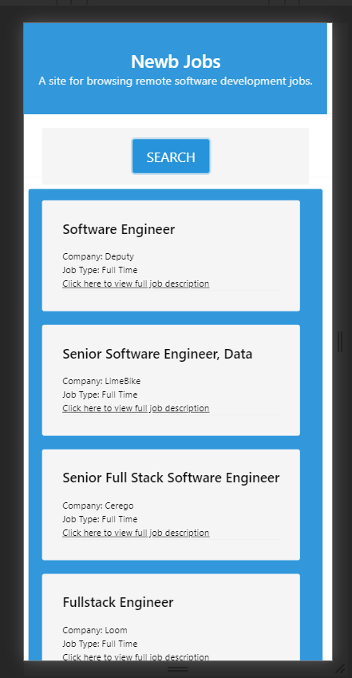
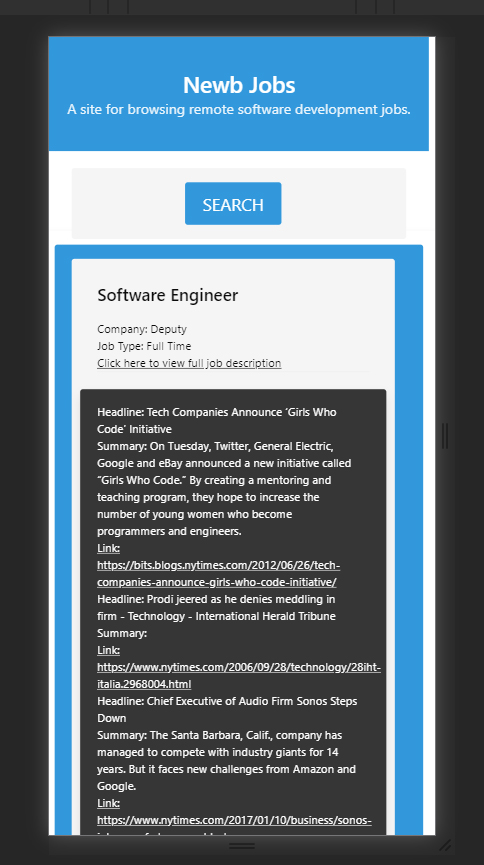

# up2U

# Newb Jobs
WebDev Job search App. Focused on remote opportunities, providing links to related articles pertaining to a search results Company.

## Description
This application gives the user a simple, streamlined interface for access to the most current career-opportunities within the industries of Web Developement and Program Engineering.
The purpose is to provide the user with a look into the current job-climate of said industries; What positions and skills are in-demand!

# Links 
Remotive API : https://remotive.io/api-documentation

GitHub Deployed : https://dohmr.github.io/up2U/

GitHub Repository : https://github.com/dohmr/up2U

# Usage
Current build requires the user to click the Search button on the landing page. The user is then presented with 10 job results provided by the https://remotive.io/ API located here https://remotive.io/api-documentation .
The user then has access to an article search of the corresponding company for each job-listing, by clicking on the company name. 3 related articles are provided. 

# Tools
Framework: https://bulma.io/

; HTML 
; jQuery 
; javaScript 

# Screens
With Job listings

;

With Job related articles

;
